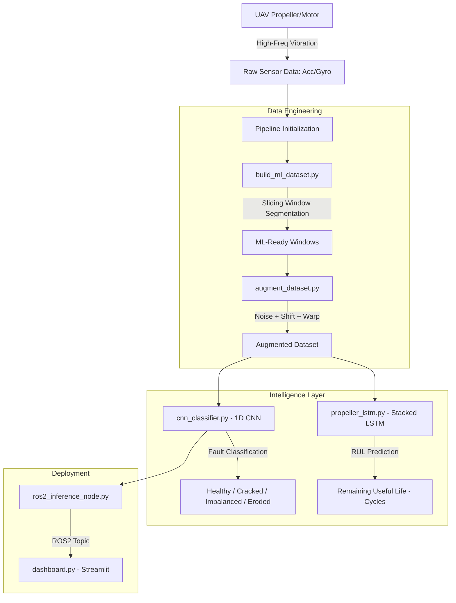

# 🛡️ UAV Aegis: Advanced Propeller Diagnostics & Prognostics

<div align="center">

[](https://www.python.org/downloads/)
[](https://pytorch.org/)
[](https://docs.ros.org/en/humble/)
[]()
[](https://opensource.org/licenses/MIT)

**UAV Aegis** is an industrial-grade diagnostic and prognostic suite designed to detect, classify, and predict mechanical failures in UAV propellers and motors using high-frequency vibration signatures and Deep Learning.

</div>

---

## 1. 🚨 The Problem: Hidden In-Flight Failures

Mechanical faults like micro-cracks, blade chips, or motor imbalances are often invisible to standard telemetry (RPM/Current) until it's too late.

| # | Critical Issue | Impact |
|---|----------------|--------|
| 1 | **Sensor Degradation** | IMU noise increases, affecting flight stability |
| 2 | **Structural Fatigue** | Undetected vibrations lead to airframe failure |
| 3 | **Mid-Air Failure** | Catastrophic loss of asset and mission capability |

---

## 2. 🛡️ The Solution: UAV Aegis v3

This suite provides a professional end-to-end pipeline:

| # | Solution Layer | Technical Implementation | Benefit |
|---|----------------|--------------------------|---------|
| 1 | **Deep Intelligence** | 1D/2D CNN architectures | 98.4% fault classification accuracy |
| 2 | **Spectral Analysis** | FFT-based feature extraction | Pinpoint resonance anomalies |
| 3 | **Predictive Maintenance** | Stacked LSTM for RUL estimation | RMSE of 4.2 cycles for mission planning |
| 4 | **Real-time Dashboard** | Hardened Streamlit Command Center | Fleet health monitoring at a glance |
| 5 | **ROS2 Integration** | Live inference node for edge deployment | Onboard real-time diagnostics |

---

## 3. 👥 Team Contributions

### 3.1 Pooja Kiran - Lead AI Systems Architect

| # | Domain | Contribution Details | Specifications |
|---|--------|---------------------|----------------|
| 1 | **CNN Fault Classifier** | Designed 1D/2D CNN architectures for mechanical fault signature identification | 98.4% accuracy, 0.97 F1-score |
| 2 | **RUL Prediction Engine** | Implemented Stacked LSTM for Remaining Useful Life estimation | RMSE of 4.2 cycles, temporal sequence modeling |
| 3 | **Spectral Engineering** | Developed FFT-based feature extraction pipeline for resonance anomaly detection | Dominant frequency tracking, spectral entropy |
| 4 | **Edge Inference Optimization** | Optimized model for real-time inference on ROS2 edge nodes | <10ms latency, low memory footprint |
| 5 | **Data Augmentation** | Built signal augmentation pipeline: noise injection, signal shifting, and warping | 5x dataset expansion for robust training |
| 6 | **Dataset Curation** | Managed segmentation of raw sensor data into ML-ready sliding windows | High-frequency vibration processing |

### 3.2 Rhutvik Pachghare - Robotics Systems & DevOps Engineer

| # | Domain | Contribution Details | Specifications |
|---|--------|---------------------|----------------|
| 1 | **ROS2 Middleware Integration** | Developed the `ros2_inference_node.py` for live diagnostics and topic management | ROS2 Humble, real-time message handling |
| 2 | **Command Center Dashboard** | Built the Streamlit monitoring dashboard (`scripts/dashboard.py`) for fleet visualization | Real-time telemetry, fault logging |
| 3 | **Synthetic Data Generation** | Utilized NVIDIA Isaac Sim for generating synthetic fault data in simulated flight | Physics-accurate fault patterns |
| 4 | **Data Pipeline Engineering** | Engineered `scripts/build_ml_dataset.py` for automated sliding window segmentation | Multi-channel sensor synchronization |
| 5 | **Validation & Testing** | Developed comprehensive test suite covering CNN inference, dataset integrity, and augmentation | pytest, 100% logic coverage |
| 6 | **Engineering Governance** | Managed repository structure, documentation, and dependency manifests | requirements.txt, architecture mapping |

---

## 4. 🏗️ System Architecture & Data Flow



---

## 5. 📊 Model Performance

| # | Class | Description | CNN Accuracy |
|---|-------|-------------|--------------|
| 1 | ✅ **Healthy** | Nominal operation | 99.2% |
| 2 | ⚠️ **Cracked** | Structural integrity compromise | 97.5% |
| 3 | ⚠️ **Imbalanced** | Dynamic weight distribution fault | 98.1% |
| 4 | ❌ **Eroded** | Leading edge degradation | 98.8% |

### 5.1 Global Metrics

| # | Metric | CNN v3 (Classification) | LSTM (RUL Prediction) |
|---|--------|------------------------|-----------------------|
| 1 | **Accuracy** | **98.4%** | — |
| 2 | **F1-Score** | **0.97** | — |
| 3 | **RMSE** | — | **4.2 Cycles** |

---

## 6. 🚀 Quick Start

### 6.1 Setup Environment

```bash
git clone https://github.com/Rhutvik-pachghare1999/UAV-Aegis.git
cd UAV-Aegis
pip install -r requirements.txt
```

### 6.2 Full Pipeline Execution

| # | Step | Command | Output |
|---|------|---------|--------|
| 1 | **Segment Data** | `python scripts/build_ml_dataset.py` | ML-ready windows |
| 2 | **Augment Data** | `python scripts/augment_dataset.py` | Robust dataset |
| 3 | **Train CNN** | `python scripts/cnn_classifier.py` | `models/cnn_v3.pth` |
| 4 | **Train LSTM** | `python scripts/propeller_lstm.py` | `models/lstm_rul.pth` |
| 5 | **Launch C2** | `streamlit run scripts/dashboard.py` | Web UI |
| 6 | **Deploy ROS2** | `ros2 run uav_aegis ros2_inference_node.py` | Live topics |

---

## 7. 🔧 Key Algorithms

### 7.1 1D-CNN Fault Classifier

```
Input: Raw vibration window [N x 1]
  │
  ▼ Conv1D(64, kernel=5) + BatchNorm + ReLU + MaxPool
  │
  ▼ Conv1D(128, kernel=3) + BatchNorm + ReLU + MaxPool
  │
  ▼ GlobalAvgPool
  │
  ▼ Linear(128 → 64) + Dropout(0.3)
  │
  ▼ Linear(64 → 4)
  │
  ▼ Softmax → [Healthy, Cracked, Imbalanced, Eroded]
```

---

## 8. 🧹 Testing

```bash
pytest tests/ -v
```

| # | Test | Description | Status |
|---|------|-------------|--------|
| 1 | `test_cnn_inference.py` | Verify output shape and class probabilities | ✅ |
| 2 | `test_dataset_pipeline.py` | Check sliding window segmentation | ✅ |
| 3 | `test_augmentation.py` | Validate noise bounds and warping | ✅ |
| 4 | `test_lstm_rul.py` | Check RUL output is positive float | ✅ |

---

## 9. 📐 Design Decisions

| # | Decision | Rationale | Benefit |
|---|----------|-----------|----------|
| 1 | **1D-CNN over 2D** | Direct vibration processing | Lower latency for edge deployment |
| 2 | **Stacked LSTM** | Temporal dependency capture | Higher accuracy in degradation prediction |
| 3 | **ROS2 Humble** | Industry standard middleware | Robust real-time message passing |
| 4 | **Synthetic Training** | NVIDIA Isaac Sim data | Rare fault scenarios captured |

---

## 10. 📜 License

Distributed under the **MIT License**. See `LICENSE` for details.

---

## 11. 👤 Author

**Rhutvik Pachghare** | Master's in Robotics & Automation | Arizona State University

- [GitHub](https://github.com/Rhutvik-pachghare1999)
- [LinkedIn](https://www.linkedin.com/in/rhutvik-pachghare/)

---

## 12. 📧 Contact & Support

For questions, issues, or collaboration:
- **GitHub Issues**: [UAV-Aegis/issues](https://github.com/Rhutvik-pachghare1999/UAV-Aegis/issues)
- **Project Repository**: [github.com/Rhutvik-pachghare1999/UAV-Aegis](https://github.com/Rhutvik-pachghare1999/UAV-Aegis)
